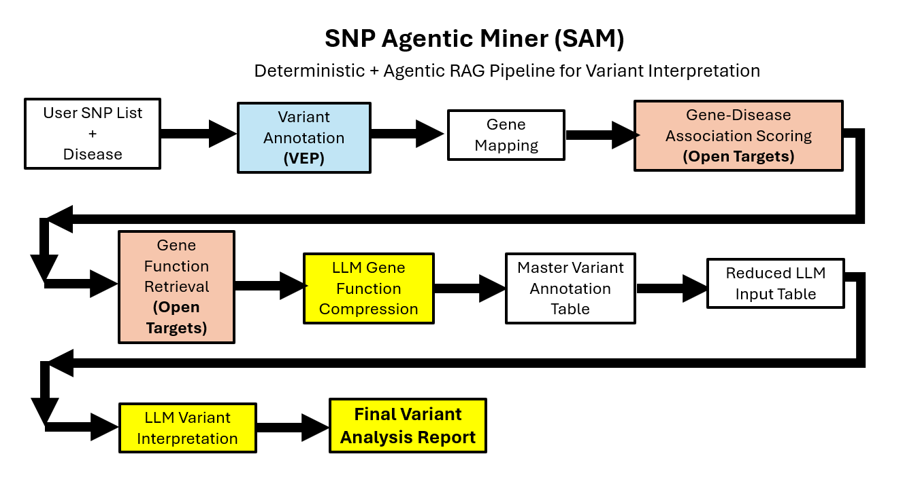

# SNP Agentic Miner (SAM)
A deterministic + agentic RAG pipeline for SNP annotation,
biological evidence retrieval, and structured variant interpretation.

SNP Agentic Miner (SAM) is a Python pipeline that analyzes genetic
variants (SNPs) in the context of a disease of interest using biomedical
APIs and controlled LLM reasoning.

The system follows a **deterministic‑first architecture**: biological
evidence is retrieved from structured databases, and LLMs are used only
for **compression and interpretation**, reducing hallucination risk
while enabling flexible biological reasoning.

The pipeline produces a **structured variant interpretation report**
highlighting biologically relevant variants and explaining their
potential mechanisms.

------------------------------------------------------------------------

# Architecture

SNP Agentic Miner (SAM) follows a **deterministic-first, agentic RAG pipeline** for variant interpretation.



The pipeline moves through three major layers:

1. **Deterministic variant annotation**
   - User SNP list and disease input
   - Variant annotation with **VEP**
   - Gene mapping
   - Gene–disease association scoring with **Open Targets**

2. **Grounded biological context building**
   - Gene function retrieval from **Open Targets**
   - LLM-based gene function compression
   - Creation of a master variant annotation table
   - Reduction into a compact LLM-ready input table

3. **Controlled LLM interpretation**
   - Row-by-row LLM variant interpretation
   - Structured final variant analysis report

This architecture keeps **biological evidence grounded in curated databases** while the LLM performs **controlled compression and interpretation rather than raw discovery**.

------------------------------------------------------------------------

# Pipeline Steps

## 1. Disease Normalization

The pipeline resolves a user‑specified disease name using the **Open
Targets API** to obtain a canonical disease identifier (EFO ID) and
synonyms.

Example:

    Input: Coronary Artery Disease
    Output: EFO_0001645

------------------------------------------------------------------------

## 2. Variant Annotation

Each SNP is annotated using the **Ensembl Variant Effect Predictor
(VEP)**.

Returned annotations include:

-   genomic location
-   affected gene
-   transcript consequence
-   predicted functional impact
-   variant classification

Output file:

    vep_annotations_table.tsv

------------------------------------------------------------------------

## 3. Gene--Disease Association Scoring

Genes affected by SNPs are evaluated against the disease using **Open
Targets evidence scores**.

These scores integrate multiple data sources:

-   genetics studies
-   literature evidence
-   drug targets
-   pathway databases

Output file:

    gene_disease_scores.tsv

------------------------------------------------------------------------

## 4. Gene Function Retrieval

The pipeline retrieves gene functional descriptions from **Open Targets
target annotations**.

Output file:

    gene_functions.tsv

------------------------------------------------------------------------

## 5. Gene Function Compression (LLM)

Gene function descriptions are often long and redundant.

An LLM compresses these descriptions into concise biological summaries.

Example:

Raw:

    Proprotein convertase subtilisin/kexin type 9 regulates degradation of LDL receptors.

Compressed:

    Regulates LDL receptor degradation controlling cholesterol levels.

Output file:

    gene_functions_reduced.tsv

------------------------------------------------------------------------

## 6. Master Annotation Table

All deterministic evidence is merged into a single structured dataset.

Output file:

    master_snp_gene_annotations.tsv

Fields include:

-   SNP identifier
-   gene
-   variant consequence
-   disease association score
-   gene function summary

------------------------------------------------------------------------

## 7. Reduced LLM Input Table

To minimize token usage and maintain model focus, a reduced table is
created containing only key interpretation fields.

Output file:

    master_snp_gene_annotations_llm.tsv

Fields include:

-   Gene
-   RSID
-   Consequence
-   Impact
-   VariantClass
-   AssociationScore
-   DiseaseName
-   ShortFunction

------------------------------------------------------------------------

## 8. LLM Variant Interpretation

Each SNP is evaluated individually by an LLM to produce structured
interpretation fields:

-   **Plausibility**
-   **Mechanism Category**
-   **Priority**
-   **Rationale**

## Example Variant Interpretation

Below is an example row from the final variant interpretation report.

| Gene | RSID | Plausibility | Mechanism | Priority | Rationale |
|------|------|-------------|-----------|----------|-----------|
| APOE | rs429358 | High | Altered protein function | High | Missense variant affecting APOE lipid metabolism |
| PCSK9 | rs11591147 | High | Loss of function | High | PCSK9 regulates LDL receptor turnover affecting cholesterol levels |

Final output file:

    variant_llm_analysis.tsv

---

## Example Output Files

The pipeline produces several intermediate artifacts to maintain transparency and reproducibility:

    vep_annotations_table.tsv
    gene_disease_scores.tsv
    gene_functions_reduced.tsv
    master_snp_gene_annotations.tsv
    master_snp_gene_annotations_llm.tsv
    variant_llm_analysis.tsv

These files represent different stages of the pipeline, from deterministic variant annotation to the final LLM-based interpretation report. In downstream workflows, users may choose to merge or prioritize specific tables depending on their triage strategy.

### Important Caveat

This prototype pipeline simplifies variant interpretation by focusing on **RSID-level associations**. It does **not currently evaluate the specific risk allele present in an individual's genotype**.

In real-world analyses using **VCF files from patients or cohorts**, interpretation must consider:

- the **observed genotype**
- the **disease-associated risk allele**
- allele frequency and population context

Future versions of the pipeline may incorporate genotype-aware analysis to support more precise variant interpretation.

------------------------------------------------------------------------

# Installation

Clone the repository:

``` bash
git clone https://github.com/mjtiv/snp-agentic-miner.git
cd snp-agentic-miner
```

Install dependencies:

``` bash
pip install -r requirements.txt
```

------------------------------------------------------------------------

# Environment Configuration

This program requires access to the **OpenAI API**.

Create a `.env` file in the root directory of the repository:

    OPENAI_API_KEY=your_api_key_here

The pipeline automatically loads this key using `python-dotenv`.

Example `.env` file:

    OPENAI_API_KEY=sk-xxxxxxxxxxxxxxxxxxxxxxxx
------------------------------------------------------------------------

# Running the Pipeline

Provide a file containing a list of SNP identifiers.

Example file:

    list_of_snps.txt

Example contents:

    rs429358
    rs688
    rs11591147

Run the pipeline:

``` bash
python SNP_Agentic_Miner_2.0.py
```

The program will generate several intermediate annotation tables and a
final variant interpretation report.

### Disease Configuration (Prototype Caveat)

In the current prototype version, the **disease of interest must be
defined directly in the script** rather than being supplied as an input
parameter.

Before running the pipeline, open the main script and modify the
`main()` function:

``` python
# Disease of Interest
disease_of_interest = "Coronary Artery Disease"
```

Replace the value with the disease you wish to analyze.

Future versions of the pipeline may allow the disease to be specified
via:

-   command-line arguments
-   configuration files
-   interactive user input

------------------------------------------------------------------------

# Version Notes

The script filename may change as the pipeline evolves (for example
`SNP_Agentic_Miner_2.0.py`, `2.1`, etc.).

Users should run the **latest version of the script included in the
repository**, as earlier versions may lack features or contain
experimental components.

Future versions of the pipeline may include:

-   genotype-aware variant interpretation
-   risk allele evaluation from VCF files
-   cohort-level analysis
-   expanded biological evidence sources

------------------------------------------------------------------------

# Output

The final interpretation results are written to:

    variant_llm_analysis.tsv

------------------------------------------------------------------------

# Design Principles

### Deterministic Evidence First

Biological evidence is retrieved from curated databases before any AI
interpretation.

### Controlled LLM Usage

LLMs are used for summarization and structured interpretation --- not
raw discovery.

### Transparent Intermediate Artifacts

Each pipeline stage produces a standalone file for debugging and
reproducibility.

### Variant-Level Interpretation

Variants are evaluated individually to prevent context contamination.

------------------------------------------------------------------------

# Limitations

This prototype identifies and interprets disease‑relevant SNP loci but
**does not yet incorporate genotype directionality** (risk allele
matching).

Future improvements may include:

-   genotype parsing
-   risk allele matching
-   population‑specific interpretation
-   polygenic risk integration

------------------------------------------------------------------------

# License

MIT License

------------------------------------------------------------------------

# Acknowledgments

This project integrates data from:

-   **Ensembl Variant Effect Predictor (VEP)**
-   **Open Targets Platform**
